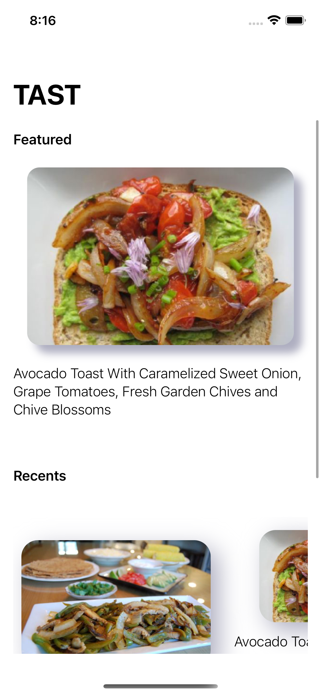
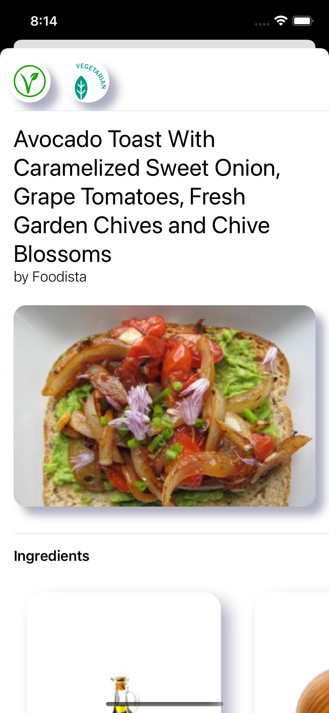

# TAST
A Recipe App Targeted Towards Helping College Students Decide what to eat. Built with SwiftUI

## Overview

This app was made to assist college students like me by giving them ideas on what they should cook for lunch or dinner. The app gives functionality to search for food that you may want to eat and if you are completely lost you can try looking at the app's featured section.

Built on Spoonacular's Recipe Api, the recipes are sourced from a large number of foob blogs and are rated by foodcritics so you know that the rating on an item are accurate

### Completed Goals
- Searching for Recipes
- Having a featured recipe pop up on app load
- Creating ingreadient cards with pictures rather than listing out 
- Built a session history that saves what ingredients you have looked at

### Future Work: 
- Persistent History
- A means to delete that persistent history
- Fix weird UI glitches

### Home Screen 

### Ingredient Screen 

